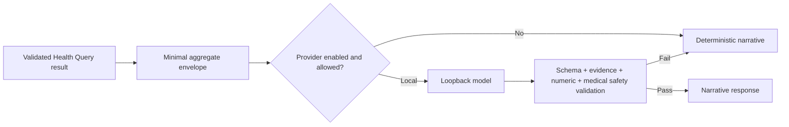

# AI architecture

The gateway implements a provider-neutral `HealthNarrativeProvider` interface. The always-enabled deterministic provider makes the app complete without AI. The local provider accepts only loopback `localhost`, `127.0.0.1`, or `::1`, calls OpenAI-compatible `/models` and `/chat/completions`, uses temperature zero, an output-token cap, a timeout, and JSON response format. Hugging Face and OpenAI external provider classes are disabled fallbacks in RC4.

The gateway never sends raw samples, notes, routes, medication, identities, or secrets. An external provider requires separate implementation, processor/privacy review, explicit consent, data-region/retention decision, and its own fixed eval result before activation.
