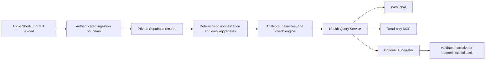

# Architecture

## Authority and data flow

The canonical chain ends at deterministic aggregates, findings, and evidence. AI receives only the bounded result envelope and cannot read databases directly, run arbitrary SQL, write records, change a deterministic result, or introduce unsupported measurements.

## Trust boundaries

| Boundary                    | Trusted input                | Enforcement                                                   |
| --------------------------- | ---------------------------- | ------------------------------------------------------------- |
| Browser to Supabase         | Signed user session          | Explicit table grants plus owner RLS                          |
| Shortcut to ingestion       | Scoped random token          | SHA-256 hash lookup, expiry, revocation, idempotency          |
| FIT upload to worker        | Private server request       | Bearer token, size/type/CRC checks, no shell invocation       |
| MCP client to query service | OAuth subject and scopes     | Tool allowlist, per-operation scope, date and output caps     |
| Query result to AI          | Validated aggregate envelope | Prompt delimiting, schema validation, evidence/numeric checks |

## Deployment units

- The web app is a Next.js monorepo target, with Vercel preferred and Netlify documented only as an alternative.
- Supabase provides Auth, Postgres, private Storage, and the ingestion Edge Function.
- The FIT worker is a separate non-root container and must remain private/authenticated.
- MCP uses stdio for Codex and loopback HTTP for local validation. A remote connection requires OAuth and a private Secure MCP Tunnel; public MCP is prohibited for this release.

See `DECISIONS.md` for material architecture choices and `docs/DETERMINISTIC_AUTHORITY.md` for invariants.
